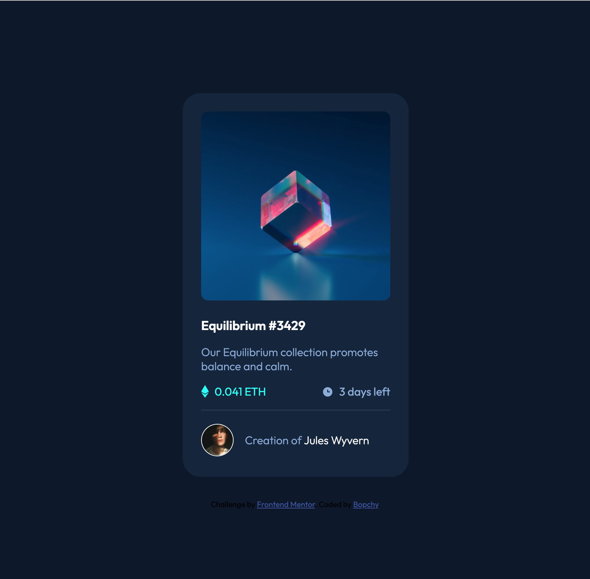

# Frontend Mentor - NFT preview card component solution

This is a solution to the [NFT preview card component challenge on Frontend Mentor](https://www.frontendmentor.io/challenges/nft-preview-card-component-SbdUL_w0U). Frontend Mentor challenges help you improve your coding skills by building realistic projects. 

## Table of contents

- [Frontend Mentor - NFT preview card component solution](#frontend-mentor---nft-preview-card-component-solution)
  - [Table of contents](#table-of-contents)
    - [The challenge](#the-challenge)
    - [Screenshot](#screenshot)
    - [Links](#links)
  - [My process](#my-process)
    - [Built with](#built-with)
    - [What I learned](#what-i-learned)
  - [Author](#author)

**Note: Delete this note and update the table of contents based on what sections you keep.**

### The challenge

Users should be able to:

- View the optimal layout depending on their device's screen size
- See hover states for interactive elements

### Screenshot



### Links

- Solution URL: [solution](https://www.frontendmentor.io/solutions/nft-preview-card-component-gJjk9wMS0)
- Live Site URL: [live site](https://compassionate-einstein-384c1d.netlify.app/)

## My process

### Built with

- Semantic HTML5 markup
- CSS
- Flexbox
- Mobile-first workflow

### What I learned

I learnt how to do an image overlay (the teal overlay that is added when the card is in an active state), and it was pretty exciting. It involved creating another `<div>` on top of the card image to contain the icon and its background color, using CSS position attributes `relative` and `absolute`. 

My initial solution was to place the background color on the `card-image-container` div then lower the opacity of the `card-image` div to reveal it when the card was active, but this didn't work well as the `card-image` corners were transitioning slower; and adding a small teal border on the corners for a split second. Adding the `view-icon` div and placing the background color on it instead fixed the issue.

```html
<div class="card-image-container">
  
  <div class="view-icon">
    
  </div>
</div>
```
```css
.card-image-container {
  width: 100%;
  margin-bottom: 1.5rem;
  position: relative;
}
.card-image {
  width: 100%;
  height: auto;
  border-radius: 0.625rem;
  transition: .5s ease;
  opacity: 1;
  display: block;
}
.view-icon {
  position: absolute;
  top: 50%;
  left: 50%;
  transition: .5s ease;
  opacity: 0;
  transform: translate(-50%, -50%);
  background-color: hsl(178, 100%, 50%, 0.4);
  width: 100%;
  height: 100%;
  border-radius: 0.625rem;
}
.view-icon img {
  top: 50%;
  left: 50%;
  position: absolute;
  transform: translate(-50%, -50%);
}
.card:active  .view-icon {
  opacity: 1;
}
```

## Author

- Frontend Mentor - [@bopchy](https://www.frontendmentor.io/profile/Bopchy)
- Twitter - [@bopchybeau](https://www.twitter.com/bopchybeau)
