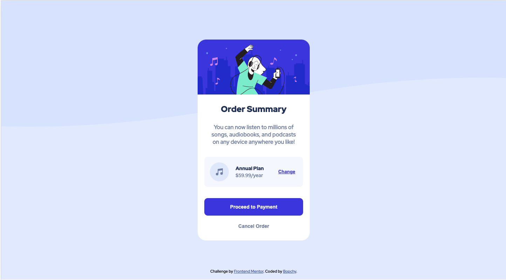

# Frontend Mentor - Order summary card solution

This is a solution to the [Order summary card challenge on Frontend Mentor](https://www.frontendmentor.io/challenges/order-summary-component-QlPmajDUj). Frontend Mentor challenges help you improve your coding skills by building realistic projects. 

## Table of contents

- [Frontend Mentor - Order summary card solution](#frontend-mentor---order-summary-card-solution)
  - [Table of contents](#table-of-contents)
  - [Overview](#overview)
    - [The challenge](#the-challenge)
    - [Screenshot](#screenshot)
    - [Links](#links)
  - [My process](#my-process)
    - [Built with](#built-with)
    - [What I learned](#what-i-learned)
  - [Author](#author)

## Overview

### The challenge

Users should be able to:

- See hover states for interactive elements

### Screenshot



### Links

- Solution URL: [Solution](https://github.com/Bopchy/frontend-mentor-projects/tree/main/order-summary-component-main)
- Live Site URL: [Live site](https://dazzling-hypatia-4e5e2f.netlify.app/)

## My process

### Built with

- Semantic HTML5 markup
- Dart Sass
- Flexbox
- Mobile-first workflow

### What I learned

I learnt that I could watch for `.scss` file changes using the Dart Sass `sass --watch` CLI command. I thought that I would have to use a task runner (Gulp) or the [node-sass](https://www.npmjs.com/package/node-sass) library.
```json
"scripts": {
    "compile-scss": "sass styles/input.scss styles/output.css --watch"
  }
```

## Author

- Frontend Mentor - [@yourusername](https://www.frontendmentor.io/profile/Bopchy)
- Twitter - [@yourusername](https://www.twitter.com/bopchybeau)
