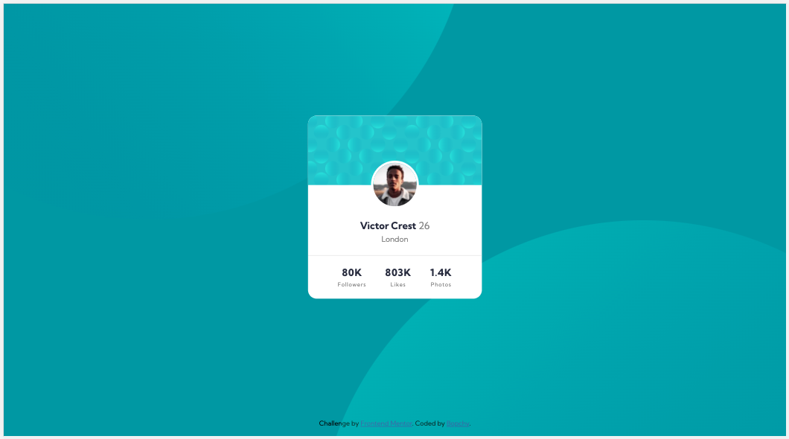

# Frontend Mentor - Profile card component solution

This is a solution to the [Profile card component challenge on Frontend Mentor](https://www.frontendmentor.io/challenges/profile-card-component-cfArpWshJ). Frontend Mentor challenges help you improve your coding skills by building realistic projects. 

## Table of contents

- [Frontend Mentor - Profile card component solution](#frontend-mentor---profile-card-component-solution)
  - [Table of contents](#table-of-contents)
  - [Overview](#overview)
    - [The challenge](#the-challenge)
    - [Screenshot](#screenshot)
    - [Links](#links)
  - [My process](#my-process)
    - [Built with](#built-with)
    - [What I learned](#what-i-learned)
  - [Author](#author)

## Overview

### The challenge

- Build out the project to the designs provided

### Screenshot



### Links

- Solution URL: [click here](https://www.frontendmentor.io/solutions/responsive-profile-card-component-using-css-grid-and-flexbox-ZyIaSgFe6)
- Live Site URL: [click here](https://brave-edison-be2c65.netlify.app/)

## My process

### Built with

- Semantic HTML5 markup
- CSS3
- Flexbox
- CSS Grid
- Mobile-first workflow

### What I learned

I learnt how to place elements on top of each other using Flexbox and a negative margin. Had no idea I could do that 🤯- a combination of `relative` and `absolute` positioning has always been my default go to. That didn't work in this case though, because absolute positioning with the current HTML structure would mean that I would have to explicitly define the height of the card, as `absolute` positioned elements cannot influence the dimensions of their parents. 

```html
<section class="card">
  ...
  <div class="card-details">
    ...
  </div>
</section>
```
```css
.card {
  ...
  display: flex;
  flex-direction: column;
}
.card-details {
  margin-top: -14%;
}
```

## Author

- Frontend Mentor - [@Bopchy](https://www.frontendmentor.io/profile/Bopchy)
- Twitter - [@bopchybeau](https://www.twitter.com/bopchybeau)
